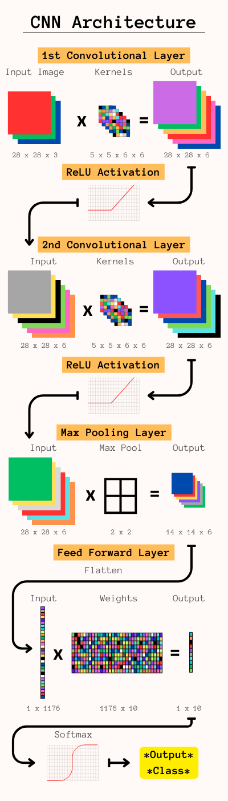

### Summary
 - Learned to build CNN only using NumPy, including Convolutional, ReLU, Max Pool, and Feed Forward layers
 - Learned to calculate and implement gradient descent
 - Achieved comparable accuracy on Fashion MNIST compared with Keras implementation (F1 = 0.890)

### Motivation
Neural network architectures are more easily accessible now than ever before, which is a huge convenience for the user but leaves a lot of understanding in the realm of abstraction for the learner. As a student of NLP and machine learning, building neural networks from scratch has helped me develop an intrinsic understanding of the architecture, strengths, and weaknesses of these models. In this project I build the architecture for an iterable <strong>[Convolutional Neural Network (CNN)](https://www.geeksforgeeks.org/introduction-convolution-neural-network/)</strong> using numpy and train it on the <strong>[Fashion MNIST](https://github.com/zalandoresearch/fashion-mnist)</strong> dataset to perform a simple classification task. My implementation is both flexible (input, kernel, pool sizes are all variable) and iterable (forward and backpropagation for layer classes are modular and can be stacked to arbitrary lengths in any order). While this implementation achieves similar results to the Keras benchmark, there has been no optimization or refactoring so runtimes are orders of magnitude greater.

### Testing Results
Achieved Accuracy: 0.891, F1 Score: 0.890 compared to Keras accuracy of 0.887. Both results achieved by training on all 60k images with learning rate of 0.005 for 3 epochs. The architecture used was: 
1. 28x28x1 Convolutional Layer with 6 5x5 kernels using full padding and learned bias
2. 28x28x6 ReLU Layer
3. 28x28x6 Convolutional Layer with 6 5x5 kernels using full padding and learned bias
4. 28x28x6 ReLU Layer
5. 28x28x6 Max Pooling Layer with 2x2 pool size
6. 1176x1 Softmax Layer with sigmoid activation

### Sources
- [High Level Introduction](https://www.geeksforgeeks.org/introduction-convolution-neural-network/)
- [Understanding Each Layer](https://towardsdatascience.com/a-guide-to-convolutional-neural-networks-from-scratch-f1e3bfc3e2de)
- [Convolution vs. Cross-Correlation](https://towardsdatascience.com/convolution-vs-cross-correlation-81ec4a0ec253)
- [Activation Function Backpropagation](https://towardsdatascience.com/coding-neural-network-forward-propagation-and-backpropagtion-ccf8cf369f76)
- [In-Depth Tutorial (Part 1)](https://victorzhou.com/blog/intro-to-cnns-part-1/)
- [In-Depth Tutorial (Part 2)](https://victorzhou.com/blog/intro-to-cnns-part-2/)
- [In-Depth YouTube Tutorial](https://www.youtube.com/watch?v=Lakz2MoHy6o)
- [Fashion MNIST Dataset](https://pytorch.org/vision/stable/generated/torchvision.datasets.FashionMNIST.html#torchvision.datasets.FashionMNIST) ([GitHub Repo](https://github.com/zalandoresearch/fashion-mnist))