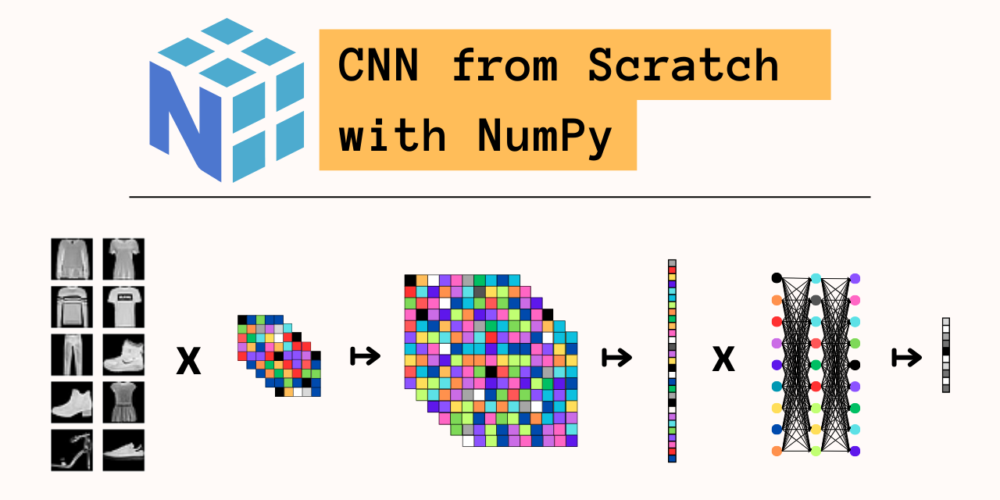

An in depth explanation for this project can be found [here](https://alvin-pc-chen.github.io/projects/irony/) 
### Summary
 - Learned to build CNN only using NumPy, including Convolutional, ReLU, Max Pool, and Feed Forward layers
 - Learned to calculate and implement gradient descent
 - Achieved comparable accuracy on Fashion MNIST compared with Keras implementation (F1 = 0.890)

### Usage
 for ideal results use python=3.10

### Motivation
Neural network implementations are more easily accessible now than ever before, abstracting away complexities like gradients, activation layers, and training algorithms. Building neural networks layer by layer from scratch helped me develop a deeper understanding of the structural capabilities and shortcomings of these models. In this project, I implement modular layers for a scalable <strong>[Convolutional Neural Network](https://www.geeksforgeeks.org/introduction-convolution-neural-network/)</strong> using numpy and train it on the <strong>[Fashion MNIST](https://github.com/zalandoresearch/fashion-mnist)</strong> dataset to perform a simple classification task.

My implementation is both <strong>flexible</strong>, with variable input, output, kernel, pool sizes, and <strong>modular</strong>, with separately implemented layers that can be arbitrarily stacked. I achieve an accuracy comparable to a TensorFlow model using the same structure (`NumPy Accuracy = 0.891` vs `Keras Accuracy = 0.887`), albeit with much slower runtime. 

### Testing Results
Achieved Accuracy: 0.891, F1 Score: 0.890 compared to Keras accuracy of 0.887. Both results achieved by training on all 60k images with learning rate of 0.005 for 3 epochs

### Sources
- [High Level Introduction](https://www.geeksforgeeks.org/introduction-convolution-neural-network/)
- [Understanding Each Layer](https://towardsdatascience.com/a-guide-to-convolutional-neural-networks-from-scratch-f1e3bfc3e2de)
- [Convolution vs. Cross-Correlation](https://towardsdatascience.com/convolution-vs-cross-correlation-81ec4a0ec253)
- [Activation Function Backpropagation](https://towardsdatascience.com/coding-neural-network-forward-propagation-and-backpropagtion-ccf8cf369f76)
- [In-Depth Tutorial (Part 1)](https://victorzhou.com/blog/intro-to-cnns-part-1/)
- [In-Depth Tutorial (Part 2)](https://victorzhou.com/blog/intro-to-cnns-part-2/)
- [In-Depth YouTube Tutorial](https://www.youtube.com/watch?v=Lakz2MoHy6o)
- [Fashion MNIST Dataset](https://pytorch.org/vision/stable/generated/torchvision.datasets.FashionMNIST.html#torchvision.datasets.FashionMNIST) ([GitHub Repo](https://github.com/zalandoresearch/fashion-mnist))